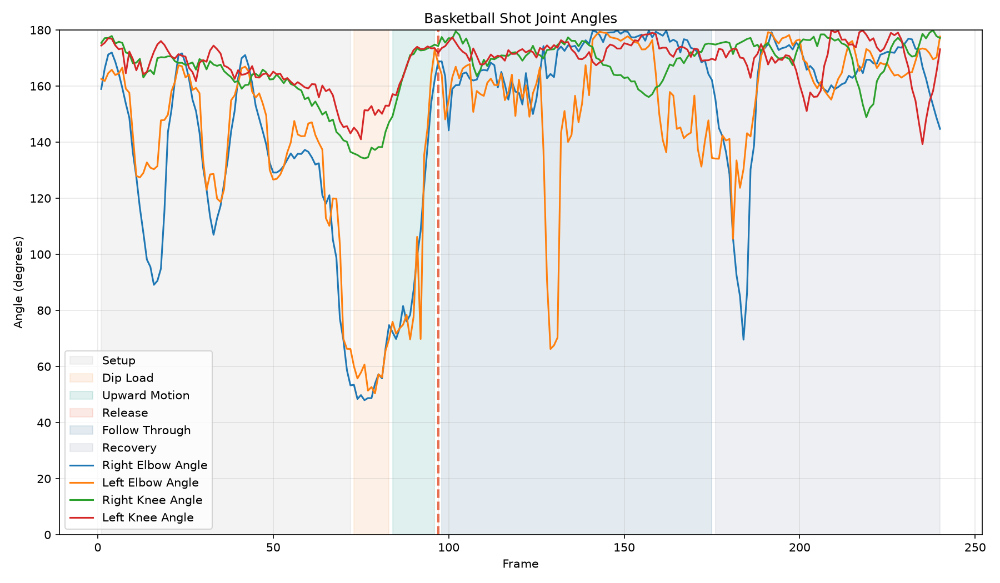

# AI Basketball Shot Analyzer

An end-to-end basketball shooting analysis app that turns a regular shot video into pose data, shooting metrics, coaching feedback, charts, annotated video, saved analysis runs, and shot-to-shot comparisons.

The goal of this project is not just to detect pose landmarks. It behaves like a small coaching product: upload a shot, get a score, understand what changed, and know what to improve next.



## Highlights

- Upload a basketball shot video from the browser.
- Detect player pose with MediaPipe.
- Extract body keypoints and joint-angle features.
- Estimate shooting side, release frame, knee bend, jump lift, arm extension, and follow-through timing.
- Generate rule-based coaching feedback and a shot score.
- Show priority improvement cards with target metrics and drills.
- Generate charts and optional annotated video.
- Save analysis runs for later review.
- Compare two saved shots manually.
- Compare the current shot to the best saved shot automatically.
- Load a built-in sample result, including annotated video, from the frontend for quick demos without uploading a file.

## Demo Flow

For a quick project walkthrough:

1. Start the backend and frontend.
2. Open the app at `http://127.0.0.1:5173`.
3. Click `Load Sample Result` to show the dashboard and annotated video instantly.
4. Upload a real shot video.
5. Review the score, feedback, improvement priorities, charts, and annotated video.
6. Click `Compare to Best` after multiple analyses to compare the current shot with the best saved one.

More presentation notes are in [docs/demo.md](docs/demo.md).

## Pipeline

```text
Video upload
-> OpenCV frame reading
-> MediaPipe pose detection
-> Body keypoints CSV
-> Feature extraction
-> Rule-based shot analysis
-> Coaching report
-> Charts and annotated video
-> Saved run history
-> Shot comparison
```

## Example Output

A saved analysis includes:

```text
storage/analyses/<run_id>/
  input/original.mp4
  data/keypoints.csv
  data/features.csv
  output/angles.png
  output/follow_through_debug.png
  output/annotated.mp4
  report.json
```

A compact sample result is available at [samples/sample-analysis.json](samples/sample-analysis.json), and the frontend demo data lives at `frontend/public/samples/sample-analysis.json`. The sample annotated video is served from `frontend/public/samples/sample-annotated.webm`.

## Setup

Create and activate a Python virtual environment:

```bash
python -m venv venv
source venv/bin/activate
```

Install backend dependencies:

```bash
pip install -r requirements.txt
```

The MediaPipe pose model should exist at:

```text
model/pose_landmarker_lite.task
```

Install frontend dependencies:

```bash
cd frontend
npm install
```

## Run Locally

Start the FastAPI backend from the project root:

```bash
venv/bin/uvicorn src.api:app --reload
```

Start the Vite frontend:

```bash
cd frontend
npm run dev
```

Open:

```text
http://127.0.0.1:5173
```

The frontend expects the backend at:

```text
http://127.0.0.1:8000
```

## API

Health check:

```bash
curl http://127.0.0.1:8000/health
```

Analyze an uploaded video:

```bash
curl -X POST "http://127.0.0.1:8000/analyze-shot" \
  -F "file=@videos/ft2.mp4"
```

Compare two saved analyses:

```bash
curl "http://127.0.0.1:8000/analyses/compare?run_a=<run_id>&run_b=<run_id>"
```

Compare one saved analysis to the best saved shot:

```bash
curl "http://127.0.0.1:8000/analyses/<run_id>/compare-best"
```

## CLI Commands

Run the complete analysis pipeline:

```bash
python src/analyze_video.py videos/ft2.mp4 --save-chart --save-annotated-video --save-report
```

Read and display a video with pose detection:

```bash
python src/video_reader.py videos/ft2.mp4
```

Save keypoints:

```bash
python src/video_reader.py videos/ft2.mp4 --save-keypoints --no-display
```

Extract features:

```bash
python src/feature_extractor.py data/ft2_keypoints.csv
```

Analyze shot features:

```bash
python src/shot_analyzer.py data/ft2_features.csv
```

Create an angle chart:

```bash
python src/visualize_features.py data/ft2_features.csv
```

Create an annotated video:

```bash
python src/video_annotator.py videos/ft2.mp4 data/ft2_features.csv
```

## Metrics

The analyzer currently estimates:

- shooting side
- release frame
- release confidence
- release elbow angle
- knee bend
- hip rise into release
- ankle-based jump lift
- follow-through duration
- follow-through end frame
- setup, load, upward motion, release, follow-through, and recovery phases
- arm motion variation

## Deployment Notes

The frontend is designed for Vercel. The backend can run on Render using `render.yaml`.

Render free or very small CPU instances can be slow for video analysis. A full request may take a few minutes because the backend runs pose detection frame by frame and may also generate annotated video. The frontend includes a visible loading state and a note explaining this delay.

If local and deployed scores differ for the same video, first verify that both environments are running the same backend version:

```bash
curl http://127.0.0.1:8000/health
curl https://ai-basketball-shot-analyzer.onrender.com/health
```

Both responses should show the same `analysis_version`. If they do not, redeploy the Render backend. The frontend on Vercel only controls the browser UI; the scoring result comes from whichever FastAPI backend it is configured to call.

For a faster hosted demo:

- Disable annotated video by default for public demos, or
- Use a larger Render instance, or
- Keep one sample result available through `Load Sample Result` so visitors can see the product immediately.

## Project Status

This is a polished rule-based MVP. It does not yet detect the ball or rim. The next major ML upgrade would be YOLO-based ball/rim tracking, but the current version already demonstrates the full product loop: video in, biomechanics out, coaching feedback, saved history, and comparison.
